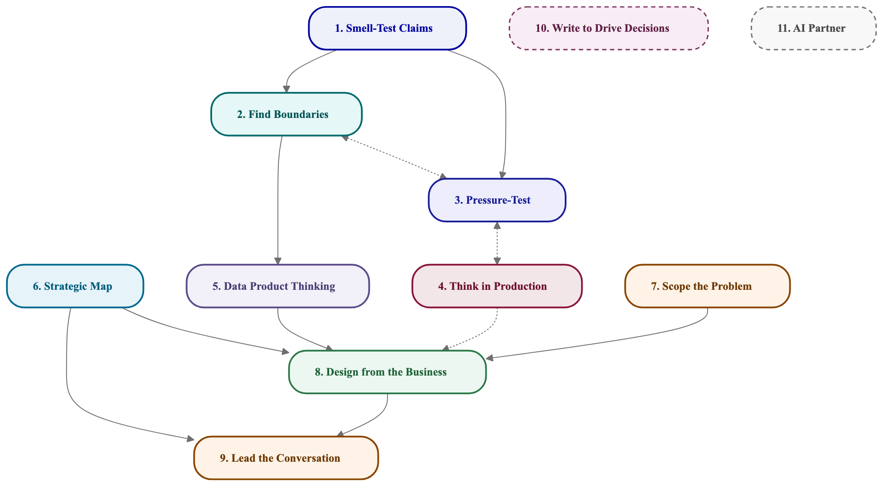

# TL Development Program — Capability Map

> **March 2026**
> A working capability map for Tech Lead development programs.
> The capabilities are proposed, not final. The resources are curated starting points, not exhaustive.
> What's missing? What's wrong? What would you add?

---

## How to read this

Ten capabilities that change how you show up in architectural conversations. Each one has:

- **The situation** — a moment you've been in where this matters
- **What changes** — what you can do afterward
- **You're ready when...** — a self-check, not a test
- **Start here** — one or two resources that get the idea across fast
- **Go deeper** — more material when you want it
- **Practice This** — a prompt to make it concrete

The capabilities aren't independent — they reinforce each other. But **Capability 1 is the gateway.** It's the smallest, most immediately useful skill, and it makes everything else more tractable. Start there unless something else grabs you.

---

## How they connect

1 is the gateway. 1 and 2 both feed 3: clarifying the claim and scoping the problem set up boundary finding. 4 and 5 are the design-stress pair. 6 builds on 3 — once you have boundaries, design what crosses them. 2 and 7 feed 8, with 7 also feeding 9: problem framing and strategic context flowing into applied platform design and leadership conversations. 10 and AI are force multipliers you use alongside everything.

---

## Capabilities

| # | Capability | Link |
|---|-----------|------|
| 1 | Smell-Test an Architectural Claim | [Smell-Test Claims](capability-01-smell-test-claims) |
| 2 | Scope the Problem | [Scope the Problem](capability-02-scope-the-problem) |
| 3 | Find the Real Boundaries | [Find Boundaries](capability-03-find-boundaries) |
| 4 | Pressure-Test a Design | [Pressure-Test](capability-04-pressure-test) |
| 5 | Think in Production | [Think in Production](capability-05-think-in-production) |
| 6 | Data Product Thinking | [Data Product Thinking](capability-06-data-product-thinking) |
| 7 | Read the Strategic Map | [Strategic Map](capability-07-strategic-map) |
| 8 | Design from the Business Down | [Design from the Business](capability-08-design-from-the-business) |
| 9 | Lead the Conversation | [Lead the Conversation](capability-09-lead-the-conversation) |
| 10 | Write to Drive Decisions | [Write to Drive Decisions](capability-10-write-to-drive-decisions) |
| — | Use AI as a Thinking Partner | [AI Partner](capability-11-ai-partner) |

---

## Books (O'Reilly Learning)

Specific chapters are linked in each capability's Go Deeper section.

- *Software Architecture: The Hard Parts* — Ford, Richards, Sadalage, Dehghani
- *Building Evolutionary Architectures* 2nd ed — Ford, Parsons, Kua, Sadalage
- *Data Mesh* — Dehghani
- *Designing Data-Intensive Applications* 2nd ed — Kleppmann & Riccomini
- *Fundamentals of Software Architecture* — Richards & Ford
- *The Software Architect Elevator* — Hohpe
- *An Elegant Puzzle* — Larson

---

## Progress

Track by capability, not by resource consumed. Mark a capability when you can do the "you're ready when" self-check — not when you've read about it.

| # | Capability | Status | Notes |
|---|-----------|--------|-------|
| 1 | Smell-Test an Architectural Claim | | |
| 2 | Scope the Problem | | |
| 3 | Find the Real Boundaries | | |
| 4 | Pressure-Test a Design | | |
| 5 | Think in Production | | |
| 6 | Data Product Thinking | | |
| 7 | Read the Strategic Map | | |
| 8 | Design from the Business Down | | |
| 9 | Lead the Conversation | | |
| 10 | Write to Drive Decisions | | |
