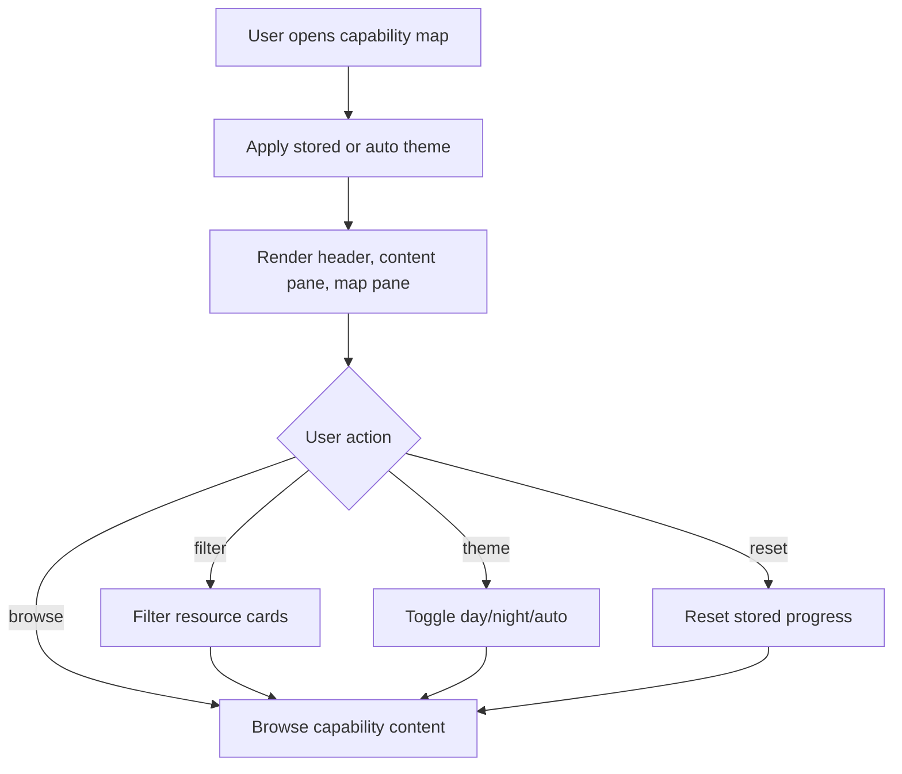

# Capability Map Interaction Parity

## Design Intent

**Context:** The existing `capability-map.html` interaction model is already accepted, so migration must preserve behavior while changing the content pipeline.

### Goals
- Preserve the exact high-level page structure: header/filter controls, left content pane, right map pane, footer behavior.
- Preserve theme toggling semantics (`day`/`night`/`auto`) and persisted preference behavior.
- Preserve resource filtering interaction and capability card browsing flow.

### Constraints
- Generated Astro output must retain equivalent layout landmarks and interaction affordances currently in `dist/capability-map.html`.
- Existing copy hierarchy and section ordering must remain intact unless explicitly changed by content sources.
- No new interaction patterns are introduced during migration.

### Non-goals
- No UX redesign.
- No component-library restyling effort.
- No behavior expansion beyond current scope.

## Interaction Surface

Single-page capability map application experience, including theme toggle, content filters, capability list rendering, and sidebar map/legend/books sections.

## User Flow

1. User opens capability map page.
2. Theme preference resolves and applies before paint.
3. User scans capabilities and optionally filters resources by type.
4. User reads relationship map and supporting notes in the right pane.
5. User may reset progress state.

## Screen States

- Initial: page shell rendered, theme resolved.
- Browsing: full capability content visible.
- Filtered: only selected format resources visible.
- Persisted preference: theme and progress states loaded from local storage.

## Edge Cases and Error States

- Missing local storage values should fall back to defaults without visible breakage.
- Unknown filter values should degrade to "all."
- Mermaid render failure should not block core content rendering.

## Design Decisions

- Keep baseline HTML structure as migration contract and implement Astro components to emit equivalent structure.
- Use parity checks to detect accidental structural drift during refactors.

## Assets

- `dist/capability-map.html` (baseline reference)
- Astro layout/component files to be introduced by implementation specs
- Test fixtures for structure parity

## Lifecycle

| Phase | Date | Commit | Notes |
|-------|------|--------|-------|
| Active | 2026-04-01 | 773bcc9 | Initial creation |
