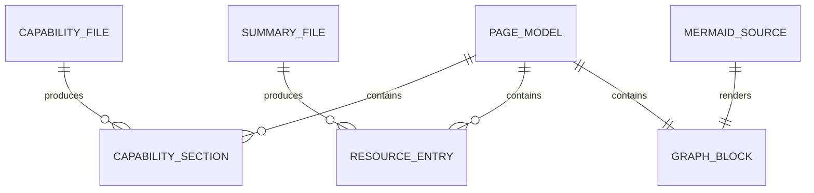
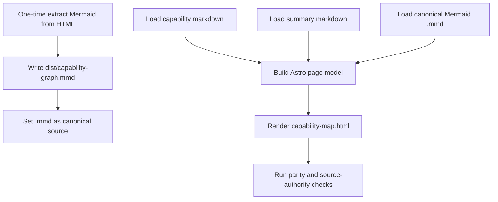

# Content and Mermaid Source of Truth

## Design Intent

**Context:** Current reality has Mermaid content embedded in HTML; future state requires `.mmd` as canonical input with generated HTML consuming that source.

### Goals
- Establish a one-way authority model where `dist/capability-graph.mmd` is canonical after migration.
- Normalize markdown content loading into a predictable page data model for Astro templates.
- Preserve deterministic generation order for capability sections and supporting summaries.

### Constraints
- One-time migration extracts Mermaid from current `dist/capability-map.html` into `dist/capability-graph.mmd`.
- After migration, manual Mermaid edits in HTML are prohibited by process and validation.
- Build must fail when generated Mermaid block diverges from canonical `.mmd` input transformation.

### Non-goals
- Changing graph semantics during authority migration.
- Introducing multiple Mermaid canonical files for the same map.
- Allowing bidirectional sync between HTML and `.mmd`.

## Data Surface

Static content source model for capability-map generation:
- Capability markdown files
- Summary markdown files
- Single canonical Mermaid `.mmd` file

## Entity Model

## Data Flow

## Schema Definitions

| Field | Type | Nullable | Constraints | Description |
|-------|------|----------|-------------|-------------|
| `capability_slug` | string | no | stable, unique | Deterministic capability key derived from filename/order |
| `capability_markdown` | string | no | non-empty | Renderable markdown body for capability section |
| `summary_refs` | array[string] | yes | path must exist when present | Linked summary documents used by resource cards |
| `mermaid_source_text` | string | no | loaded from `dist/capability-graph.mmd` | Canonical graph definition to inject/render |
| `rendered_graph_block` | string | no | must be generated from canonical source | HTML fragment for map pane graph container |

## Evolution Rules

- Markdown schema may grow with additive fields only.
- Mermaid canonical path remains single-file unless superseded by explicit design change.
- Any change in Mermaid transformation logic requires updating validation fixtures.

## Invariants

- Canonical Mermaid source path is `dist/capability-graph.mmd`.
- Build never treats embedded HTML Mermaid as authoritative after migration.
- Generated graph block is reproducible from canonical source and transformation logic.

## Edge Cases and Error States

- Missing `.mmd` file fails fast with explicit error.
- Invalid Mermaid syntax fails build with location/context diagnostics.
- Markdown parse errors isolate to the offending file and prevent publish.

## Design Decisions

- Use one-time extraction to respect current authoritative HTML state, then permanently flip authority to `.mmd`.
- Keep a single-page model pipeline to simplify parity validation and future maintenance.

## Assets

- `dist/capability-graph.mmd` (canonical post-migration)
- markdown input corpus under `dist/`
- Astro build scripts/components to implement transformation

## Lifecycle

| Phase | Date | Commit | Notes |
|-------|------|--------|-------|
| Active | 2026-04-01 | 773bcc9 | Initial creation |
