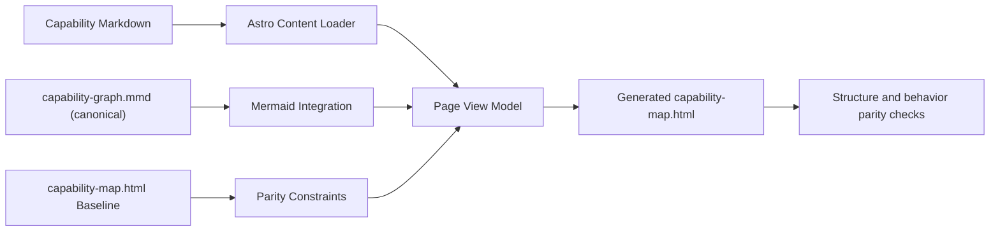

# Architecture Overview

This epic introduces a static generation seam without changing the user-facing design contract.

Architectural intent: isolate content generation concerns while retaining the existing visual contract.
