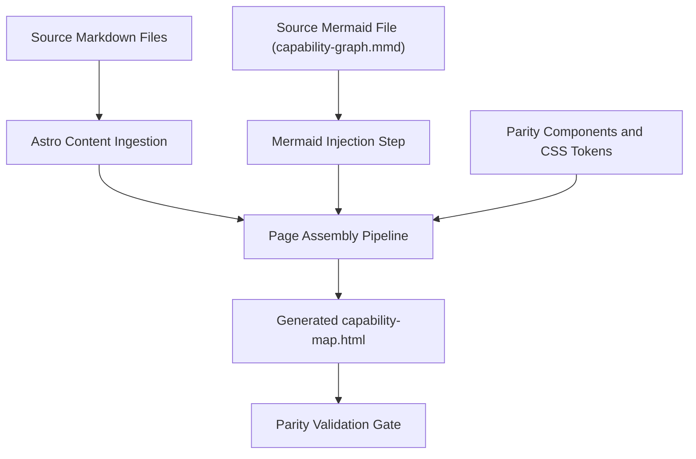

# Architecture Overview

This initiative coordinates three layers:

1. Source layer: markdown files and canonical Mermaid `.mmd`
2. Generation layer: Astro templates/components and build scripts
3. Output layer: static HTML delivered with parity to the current capability map

Primary risk control: parity validation gate before publishing.
