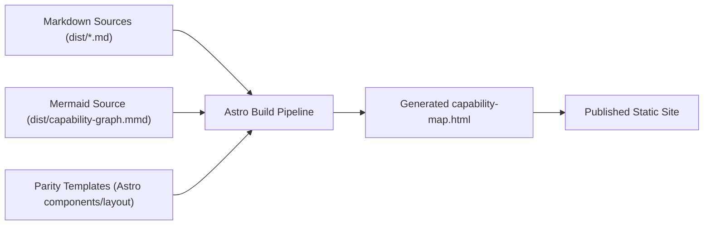

# Architecture Overview

This vision keeps the published site static while shifting authorship to source assets:

- Curriculum content from markdown in `dist/`
- Capability graph from `dist/capability-graph.mmd` (authoritative after one-time extraction)
- Presentation from Astro templates/components that preserve the current `capability-map.html` structure and styling

Key boundary: no runtime backend, no dynamic publishing service, no redesign layer.
